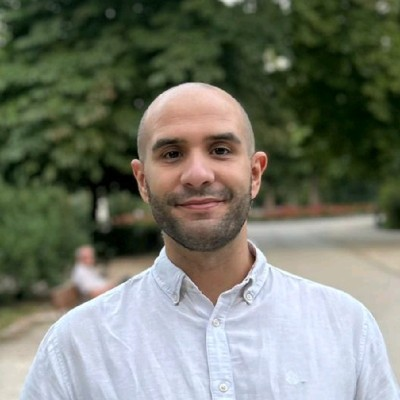

  

  <b>Daniel Gómez Domínguez</b> 
  AI Systems Architect · Director of Intelligence 
  <i>Agentic AI · LLMs · RAG · Multi-Agent Systems</i>

  <a href="https://linkedin.com/in/danigdominguez">LinkedIn</a> •
  <a href="https://amloii.github.io">Portfolio</a> •
  <a href="https://linktr.ee/amloii">Linktree</a> •
  <a href="mailto:danigdominguez@gmail.com">Email</a>

---

I architect and build AI systems for production. Currently **Director of AI at BillionHands** (NextChance Group), leading the AI strategy and building agentic systems for a global rankings platform. Previously founded the computer vision MVP that became Adsviu, led AI at Multimarkts, and detected fraud at NoFakes.

7+ years shipping AI — from research at Instituto Cajal (CSIC, *Nature Neuroscience*) to product leadership. Still hands-on: I write TypeScript, Python, and Kotlin daily.

---

## Featured Projects

<table>
  <tr>
    <td width="50%" valign="top">
      <h3>StarLight Brain</h3>
      
  

      
A second brain with semantic memory. Knowledge graph, pgvector embeddings, AI-powered capture. Cross-platform mobile + web.

      
<a href="https://github.com/Amloii/startlight-brain-app">Repo →</a>

    </td>
    <td width="50%" valign="top">
      <h3>Fight Mode</h3>
      
  

      
Gamified productivity with a samurai battle theme. AI task decomposition, warrior collection, streaks. Built at the Bolt Hackathon.

      
<a href="https://github.com/Amloii/time-killing-app">Repo →</a>

    </td>
  </tr>
  <tr>
    <td width="50%" valign="top">
      <h3>NoFakingWay</h3>
      
  

      
Multi-filter NLP pipeline for fake review and spam detection. Language, PII, and URL validation.

      
<a href="https://github.com/Amloii/NoFakingWay">Repo →</a>

    </td>
    <td width="50%" valign="top">
      <h3>Delirium Tremens</h3>
      
 

      
Zero-shot COCO dataset generator using OWL-ViT. Built for the Adsviu computer vision MVP.

      
<a href="https://github.com/Amloii/Delirium-Tremens">Repo →</a>

    </td>
  </tr>
</table>

  
More projects

  <ul>
    <li><b><a href="https://github.com/Amloii/InAFewWords">In A Few Words</a></b> — Multilingual text summarization with mT5.</li>
  </ul>

---

## Career

| Role | Company | Focus |
|---|---|---|
| **Director of AI** | BillionHands (NextChance) | Agentic AI, multi-agent systems, RAG |
| **Director of AI** | Multimarkts (NextChance) | Multimodal embeddings, vector DB, generative AI |
| **Technical Founder** | Adsviu (NextChance) | 0-to-1 CV MVP, x3 CTR, x4 Brand Awareness |
| **Lead Data Scientist** | NoFakes (NextChance) | NLP fraud detection, GPT-text detection |
| **Senior Data Scientist** | BillionHands (NextChance) | Visual search AI, +500k downloads |
| **Researcher (PhD stage)** | Instituto Cajal, CSIC | Computational neuroscience, ~900 citations |

---

  
  
  
  
  
  
  
  

  
  

  Madrid, Spain — Remote / Hybrid

